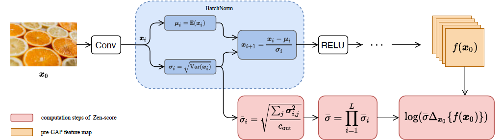
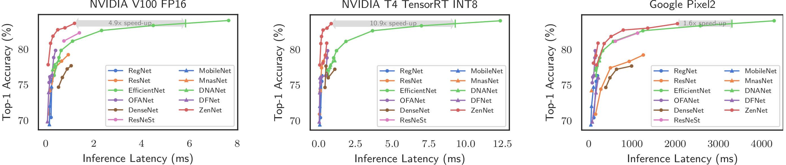

# Neural Architecture Search

## **Zen-NAS: A Zero-Shot NAS for High-Performance Deep Image Recognition. [ICCV'21].** [paper](https://arxiv.org/abs/2102.01063) [code](https://github.com/idstcv/ZenNAS) [presentation](https://www.youtube.com/watch?v=9hRC8YtzOSI)

Zen-NAS is a lightning fast, training-free Neural Architecture Searching (NAS) algorithm for automatically designing deep neural networks with high prediction accuracy and high inference speed on GPU and mobile device.

### _Searching Speed and Model Performance on ImageNet-1k._ 

Zen-NAS is able to search over 1 million networks within 12 GPU hours, achieving SOTA ImageNet-1k performance and outperforming training-based NAS methods. 

### _Applications._ 

We apply Zen-NAS in [ICCV 2021 WebFace260M Challenge](https://www.face-benchmark.org/challenge.html). Our solution ranked 1st place in SFR Track and 3rd place in Main Track.

[back](./)
